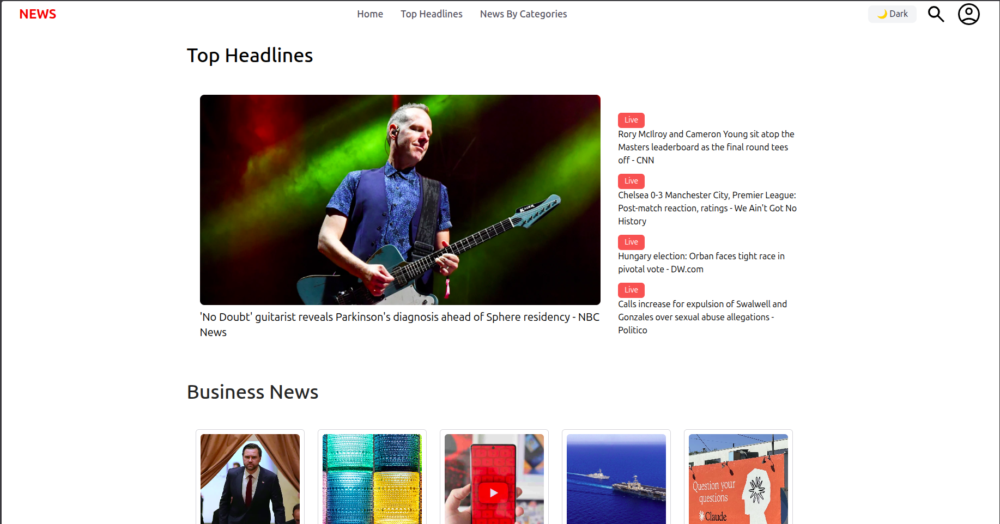
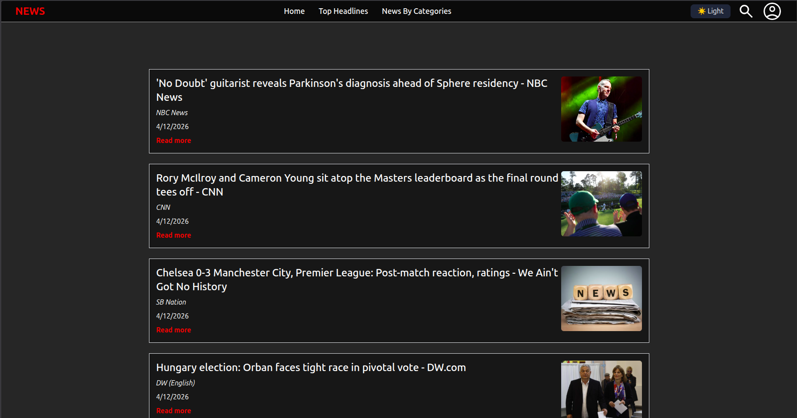
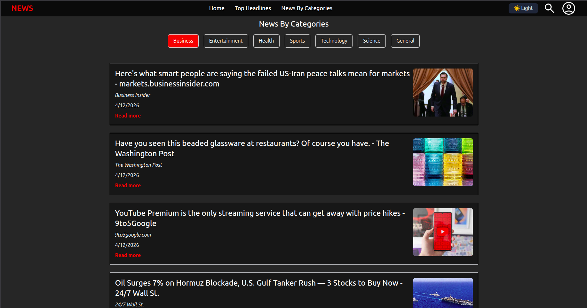
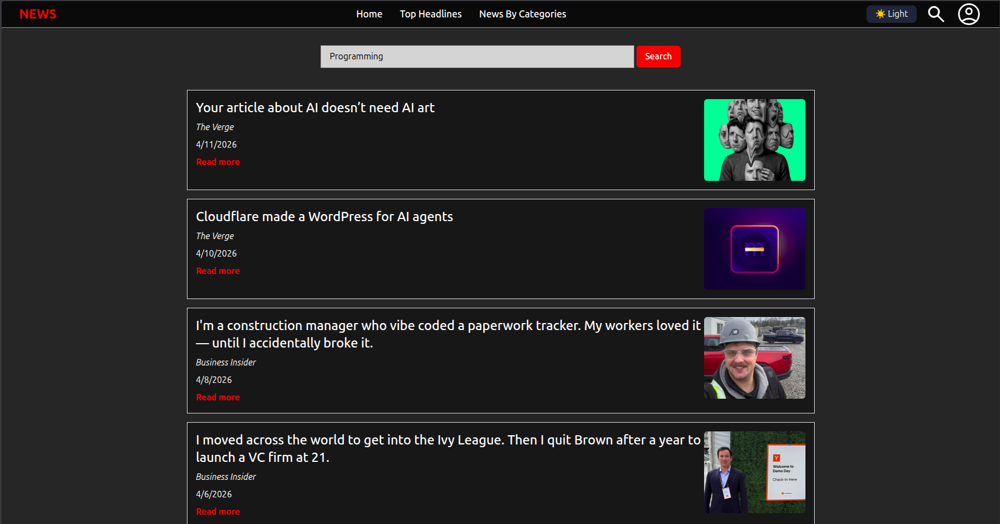
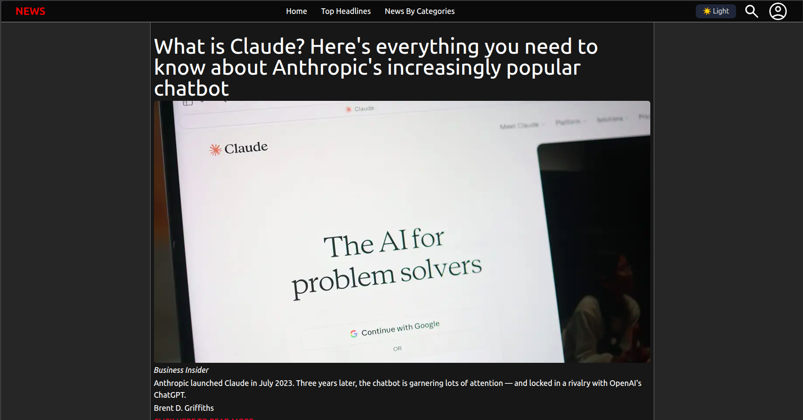

# NewsApp 📰

A modern, responsive news application built with React that delivers the latest headlines in real-time. Browse news by
categories, search for specific topics, and stay updated with current events from trusted sources.






## 🚀 Features

- **Latest Headlines**: Fetches fresh stories and updates the feed with minimal latency
- **Category Browsing**: Explore curated sections like Business, Technology, Sports, Entertainment, Health, and more
- **Powerful Search**: Query by keywords to discover relevant articles across categories and sources
- **Article Details**: Complete information including title, description, publisher/source, publish time, thumbnail, and
  external links
- **Mobile-Friendly UI**: Responsive design that adapts seamlessly to phones, tablets, and desktops
- **Real-time Updates**: Stay current with the latest news as it happens

## 🛠 Tech Stack

- **Frontend**: React 19.1.1 with modular components architecture
- **Routing**: React Router DOM 7.8.0 for client-side navigation
- **Build Tool**: Vite 7.1.0 for fast development and optimized builds
- **Styling**: CSS with responsive design principles
- **Data Fetching**: Modern fetch API for news data retrieval
- **Code Quality**: ESLint 9.32.0 with React-specific rules
- **Type Safety**: TypeScript definitions for React components

## 📦 Installation

1. **Clone the repository**
   ```bash
   git clone <repository-url>
   cd NewsApp
   ```

2. **Install dependencies**
   ```bash
   npm install
   ```

3. **Set up environment variables**
   ```bash
   # Create a .env file in the root directory
   # Add your News API key
   VITE_NEWS_API_KEY=your_api_key_here
   ```

4. **Start the development server**
   ```bash
   npm run dev
   ```

5. **Open your browser**
   Navigate to `http://localhost:5173` to view the application

## 🚦 Available Scripts

- `npm run dev` - Start development server
- `npm run build` - Build for production
- `npm run preview` - Preview production build locally
- `npm run lint` - Run ESLint for code quality checks

## 📁 Project Structure

NewsApp/
├── public/                 # Static assets
├── src/
│   ├── Components/         # Reusable UI components
│   ├── Pages/              # Main application pages
│   ├── Context/            # React Context providers
│   ├── assets/             # Images and other assets
│   ├── App.jsx             # Main application component
│   ├── App.css             # Global styles
│   ├── main.jsx            # Application entry point
│   └── index.css           # Base styles
├── package.json            # Project dependencies
├── vite.config.js          # Vite configuration
└── eslint.config.js        # ESLint configuration

## 🔧 Configuration

### News API Setup
1. Sign up for a free API key at [NewsAPI.org](https://newsapi.org)
2. Add your API key to the `.env` file
3. Configure API endpoints in your components

### Vite Configuration
The project uses Vite for fast development and building. Configuration can be found in `vite.config.js`.

## 🌟 Usage

1. **Browse Headlines**: Visit the home page to see the latest news
2. **Filter by Category**: Use the navigation menu to browse specific categories
3. **Search Articles**: Use the search bar to find articles by keywords
4. **Read Full Articles**: Click on any article to view details and access the original source

## 🤝 Contributing

1. Fork the repository
2. Create a feature branch (`git checkout -b feature/amazing-feature`)
3. Commit your changes (`git commit -m 'Add some amazing feature'`)
4. Push to the branch (`git push origin feature/amazing-feature`)
5. Open a Pull Request

## 📱 Responsive Design

The application is fully responsive and optimized for:
- 📱 Mobile devices (320px and up)
- 📱 Tablets (768px and up)
- 💻 Desktop computers (1024px and up)
- 🖥 Large screens (1440px and up)

## 🔮 Future Enhancements

- [ ] Offline reading capability
- [ ] Social media sharing
- [ ] User preferences and favorites
- [ ] Push notifications for breaking news
- [ ] Multi-language support


## 🙏 Acknowledgments

- [NewsAPI](https://newsapi.org) for providing news data
- [React](https://reactjs.org) team for the amazing framework
- [Vite](https://vitejs.dev) for the lightning-fast build tool

---

**Made with ❤️ by Rohan Pathak**

For any questions or support, please contact rohanpathak258@gmail.com